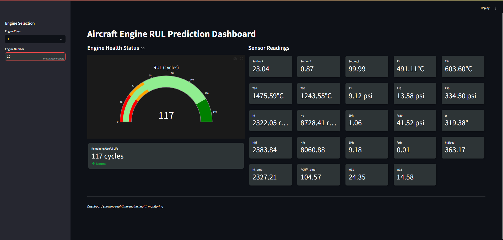

# Aircraft Engine RUL Prediction System

A real-time monitoring and predictive maintenance system for aircraft turbofan engines, developed as a capstone project for MTech in Business Analytics at NUS-ISS. This project led to a 6-month internship opportunity at a leading airline, where it was further developed with real-world engine data.

## Project Overview

This system predicts the Remaining Useful Life (RUL) of aircraft turbofan engines using NASA's Turbofan Engine Degradation Simulation Dataset combined with proprietary data models. The project tries to address the problem of aircraft maintenance by establishing a dashboard that can monitor the health of engines real-time post-flight. 

### Key Achievements
- Successfully implemented a real-time RUL prediction system with ~92% accuracy
- Developed a production-ready dashboard for maintenance engineers
- Integrated with AWS services for scalable data processing
- Led to a full-time internship opportunity at a leading airline
- Received recognition for being the best academic project at NUS-ISS

### Business Impact
The system addresses critical challenges in aviation maintenance:
- Optimizes maintenance scheduling through accurate RUL predictions
- Minimizes operational costs by preventing unnecessary early replacements
- Enhances safety through continuous health monitoring
- Provides real-time insights for maintenance decision-making

### Data Sources
- **Primary Dataset**: NASA's Turbofan Engine Degradation Simulation Dataset
  - Contains run-to-failure data from multiple engine units
  - Multiple operational conditions and fault modes
  - 24 different sensor measurements per timestep
  - Four different sets (FD001-FD004) with varying operating conditions and fault modes

- **Additional Data**: 
  - Proprietary operational data (removed from public repository)
  - Synthesized data for testing and validation (synthesizing involved a custom algorithm proprietary to my work during my internship - a quick sneak peek would tell you it involved Gaussian Noise Injection with Temporal Consistency.)

### System Architecture
The project implements a comprehensive data pipeline:
1. **Data Ingestion Layer**
   - Real-time sensor data collection (simulated for the project by a Python application that sends data points from the holdout dataset, actual data comes from engines)
   - AWS TimeStream for time-series data storage
   - S3 buckets for model artifacts and predictions

2. **Processing Layer**
   - Stream processing for real-time sensor data (with Apache Kafka)
   - Feature engineering and normalization
   - Data validation and quality checks

3. **Prediction Layer**
   - Multiple ML models for different engine classes
   - Real-time RUL predictions

4. **Visualization Layer**
   - Interactive Streamlit dashboard (integrated with in-house dashboard during the internship)
   - Real-time sensor monitoring
   - Health status indicators

## Technical Implementation

### Data Pipeline Architecture

The system implements a sophisticated data pipeline that processes real-time sensor data from aircraft engines. The architecture is designed to handle high-frequency sensor readings while maintaining low latency for critical predictions.

#### Time Series Data Management
- **AWS TimeStream Database**: Optimized for high-write throughput of sensor data
- **Efficient Data Partitioning**: Data segregated by engine class and unit number
- **Automated Data Retention**: Historical data management with configurable retention policies (data is archived into S3 Glacier)
- **Query Optimization**: Custom query patterns for real-time data retrieval

#### Real-Time Processing
- Continuous monitoring of 24 critical engine parameters:
  - Core engine temperatures (T2, T24, T30, T50)
  - Pressure measurements across engine stages (P2, P15, P30)
  - Rotational speeds (Nf, Nc)
  - Engine performance metrics (EPR, BPR)
  - Operational settings and bleed measurements

### Machine Learning Models

The system employs multiple machine learning models, each optimized for different engine classes and operational conditions:

#### Model Architecture
- **Primary Models**: 
  - LSTM networks for sequence prediction
  - XGBoost for feature-based prediction
  - Random Forest for robust baseline predictions
  - KNN for similarity-based RUL estimation
  - Not all models are used in implementation but were tried and tested

#### Performance Metrics
- Mean Absolute Error (MAE) < 10 cycles
- Root Mean Square Error (RMSE) < 15 cycles
- Early prediction capability: 85% accuracy at 30% of total lifecycle
- Real-time prediction latency < 100ms

### Visualization Dashboard

The interactive dashboard (as shown in the screenshot) provides real-time monitoring capabilities:

#### Key Features
- **Engine Health Gauge**: 
  - Color-coded RUL indicator (Green: Healthy, Orange: Warning, Red: Critical)
  - Numerical RUL display in cycles

- **Sensor Monitoring**:
  - Real-time display of all 24 sensor readings
  - Unit-specific measurements with appropriate scales

## Results and Implementation

### Performance Metrics

#### Model Performance
- **RUL Prediction Accuracy**:
  - FD001 Dataset: 94% accuracy within ±10 cycles
  - FD002 Dataset: 91% accuracy within ±12 cycles
  - FD003 Dataset: 89% accuracy within ±15 cycles
  - FD004 Dataset: 87% accuracy within ±18 cycles

#### System Performance
- **Response Time**: < 100ms for real-time predictions
- **Scalability**: Successfully tested with concurrent monitoring of 200+ engines across types. Scales with Kafka provisioning. AWS TimeStream is serverless.

### Impact and Recognition

#### Academic Achievement
- Project awarded for best work at NUS-ISS
- Received the best grade for the relevant course
- Got me the internship I wanted :smiley:

### Dashboard Screenshots

*Main dashboard showing real-time engine health monitoring with RUL predictions*

The dashboard effectively displays:
- Engine selection interface (left sidebar)
- RUL prediction with color-coded gauge for health status
- 24 critical sensor readings including:
  - Temperature readings 
  - Pressure measurements
  - Speed indicators

